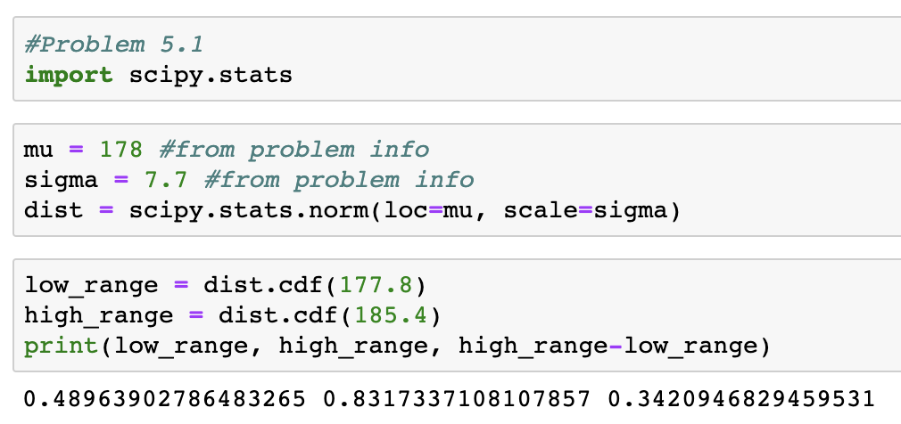

[Think Stats Chapter 5 Exercise 1](http://greenteapress.com/thinkstats2/html/thinkstats2006.html#toc50) (blue men)

>> In order to find the percentage of US men in the specified range, we can find the CPD for the upper end of the range (6'1) and subtract the CPD for the lower end of the range (5'10)

### Python Code Used:

